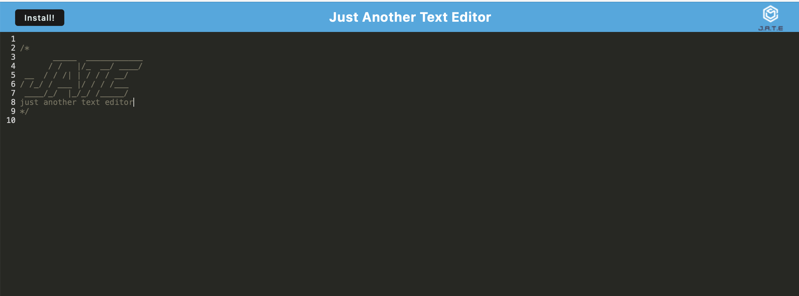

# personal-pwa-text-editor

# Tech Tonic blog


## Links

[JATE deployed site](https://fierce-refuge-54485.herokuapp.com)

## Table of Contents

* [Description](#description)
* [Installation](#installation)
* [Code Example](#code-example)
* [Application Examples](#application-examples)
* [Usage](#usage)
* [License](#license)
* [Questions](#questions)


## Description
JATE is minimalistic a full stack application that allows users to create, edit, and manage text documents seamlessly allowing the user to work anytime, anywhere. Experience the convenience of a single-page application designed to meet Progressive Web App (PWA) criteria. The JATE app will automatically adapt and utilize alternative data persistence methods, ensuring content is always safe and accessible. JATE also allows clients to work on documents even when offline, and once reconnected to the web, the changes are automatically synced.

## Installation
Installation is quick and simple, simply visit the JATE site link above and click on the install button on the page load.

## Code Example
Below is an example of code working to incorporate asset caching
```JS
// implements asset caching
registerRoute(
  ({ request }) => ['style', 'script', 'worker'].includes(request.destination),
  new StaleWhileRevalidate({
    cacheName: 'asset-cache',
    plugins: [
      new CacheableResponsePlugin({
        statuses: [0, 200],
      })
    ]
  })
);
```

## Application Examples
Bellow is an example of the application running within the deployed link

Loads up the page an a button to install


---


## Usage


Make sure you have followed the deployed link within the [links](#links) section. After following the deployed link, the user will be greeted with the JATE logo and a button to install the link in the upper left hand of the screen. The user can then use the app to create their own text which can be used for writing anything down such as notes. If the connection was to become unstable or total loss of an internet connection, all notes will still be present and sync up once a connection is re-established. This allows for taking the app offline when needed. If an install is initiated, an app will be downloaded to your local machine to use without needing to visit the link.


## License
For additional information on this license please use the provided link


[MIT License](https://choosealicense.com/licenses/mit/)

## Questions
Please refer any questions to my Github

Github: [jonnyboy808](https://github.com/jonnyboy808)


